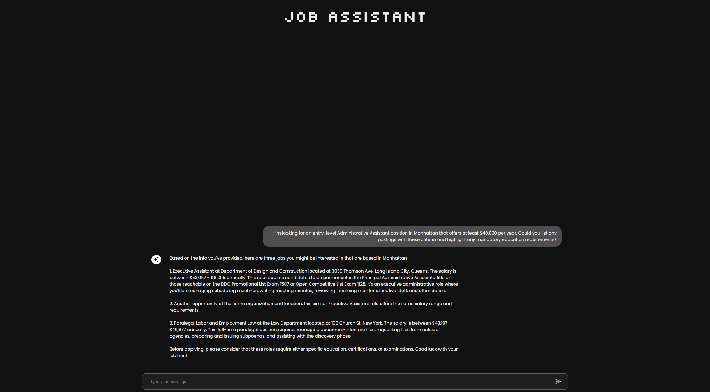
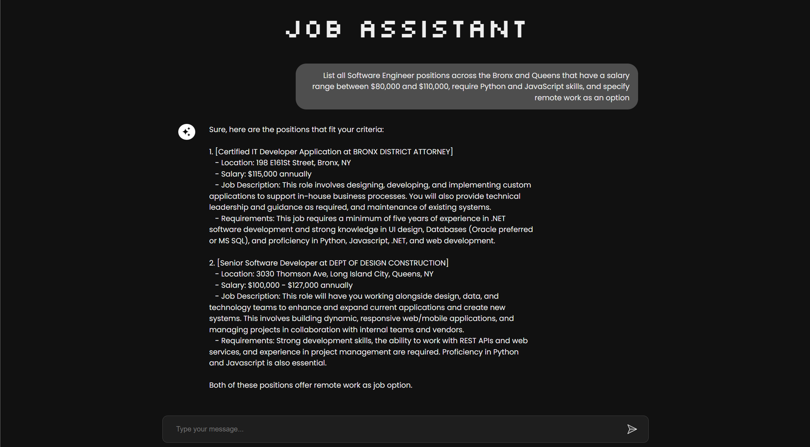

# JobAssistant — RAG-powered Job Search (Flask)

Conversational assistant for exploring a jobs dataset (NYC_Jobs_Cleaned.csv by default).  
Uses Retrieval-Augmented Generation (RAG) for **skill-based matching, location extraction, job-type filtering, summarization, and comparisons**.

---

## ✨ Features
- Conversational chat UI (Flask + HTML/CSS/JS)
- Skill-based job recommendations
- Location extraction from free-text job descriptions
- Job type filtering (internship, Werkstudent, full-time, etc.)
- Summarize and compare multiple jobs side-by-side
- Trending skills and job insights
- Clean secret handling with `.env`

---

## 📂 Project Structure
```
JobAssistant/
├── app/
│ ├── init.py
│ └── retrieval.py # Retrieval logic + LLM calls (uses env vars)
│
├── data/
│ ├── NYC_Jobs_Cleaned.csv # Sample dataset
│ ├── job_embeddings.npy # Generated embeddings (ignored by git)
│ └── conversation_history.json # Runtime state (ignored by git)
│
├── env/ # Virtual environment (ignored by git)
│
├── static/
│ ├── css/
│ │ └── style.css
│ ├── js/
│ │ └── script.js
│ ├── ai.png
│ └── image.png
│
├── templates/ # Flask HTML templates (chat UI)
│
├── app.py # Flask entrypoint
├── requirements.txt # Python dependencies
├── Procfile # Deployment (e.g., Heroku)
├── .gitignore # Git ignore rules
└── .env.example # Example env file (commit this, not .env)

```
---

## ⚙️ Quickstart

### 1. Clone the Repo
```bash
git clone https://github.com/kd1121/JobAssistant.git
cd JobAssistant
```
### 2. Create a Virtual Environment
```bash
python -m venv env
# Windows
env\Scripts\activate
# macOS/Linux
source env/bin/activate
```
### 3. Install Dependencies
```bash
pip install --upgrade pip
pip install -r requirements.txt
```
### 4. Add Environment Variables
```bash
cp .env.example .env
```
### Then edit .env and add your real API keys:
```bash
FLASK_ENV=development
OPENAI_API_KEY=sk-xxxx
OPENAI_MODEL=gpt-4o-mini
OPENAI_EMBED_MODEL=text-embedding-ada-002
```
### 5. Run the App
```bash
python app.py
# or
flask --app app.py run --debug
```
---
## 🔐 Secrets & Safety

Do not hardcode API keys in your code.
Use .env (ignored by git).
Only commit .env.example with placeholders.
If you ever committed a real key:
Rotate it in the provider dashboard.
Remove it from git history (git filter-repo).
Force push.

## 🧠 RAG Flow

Parse query → extract skills, locations, job types
Retrieve top-k jobs from embeddings (job_embeddings.npy)
Rank + deduplicate results
Build context and feed into LLM
Generate answer (with summaries, comparisons, follow-ups)

## 📊 Dataset Notes

Columns: id, title, description, occupation, employer_description, insertion_date
No explicit location column → locations are extracted from description

### 🛠️ Useful Commands
```bash
# Rebuild requirements.txt
pip freeze > requirements.txt

# Rebuild embeddings
python -m app.retrieval

# Run dev server
flask --app app.py run --debug
```

## 🤝 Contributing

1. Fork this repo
2. Create a feature branch: git checkout -b feat/awesome
3. Commit changes: git commit -m "feat: added awesome feature"
4. Push branch: git push origin feat/awesome
5. Open Pull Request

## 📜 License

MIT — free to use, modify, and share.

## 🙌 Credits

Built with ❤️ by Kishan & team.


---

## 📸 Screenshots

### 🔹 Chat UI

---

---
### 🔹 AI Icon


